# Agentic Workshop

## Setup

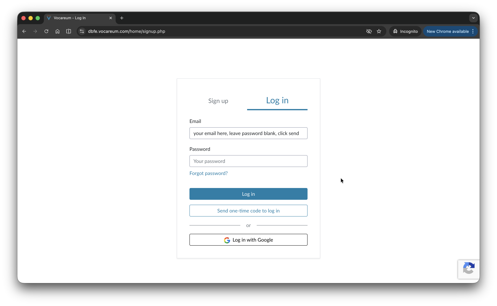

In Chrome or Edge, go to https://dbfe.vocareum.com/, then click on `Log in`. Key in your email address, and leave password blank. Click on `Send one-time code`. Check your inbox for the OTP and key it in.

> If you get an error which says `Security verification failed`, use Chrome or Edge, and do NOT use incognito.

Click on `Agent Bricks Lab` to start the lab.

Enter the access code given by the instructor.

If the `Lab Status` does not say `Ready`, click on `Start lab`. The lab should take a few minutes to start. Once the `Lab Status` says `Ready`, you should see the Databricks console.

> If you see an error message which says `Lab ended` or `Budget exceeded` or `Your total lab usage time of 240 minutes has exceeded the total allocated time of 240 minutes`, please inform the instructor. Instructors, please go to `Class`, search for student's email, click on `Budget`, and set `Total time budget` to `User specfic` and `3000 minutes`. Do the same for `Monthly time budget` and click `Save`. Ask student to click on refresh button in the Vocareum lab page, lab should automatically start.

Next click on `Databricks Workspace`. It should bring you to the Databricks console in a new tab. You will be doing the rest of the lab here.

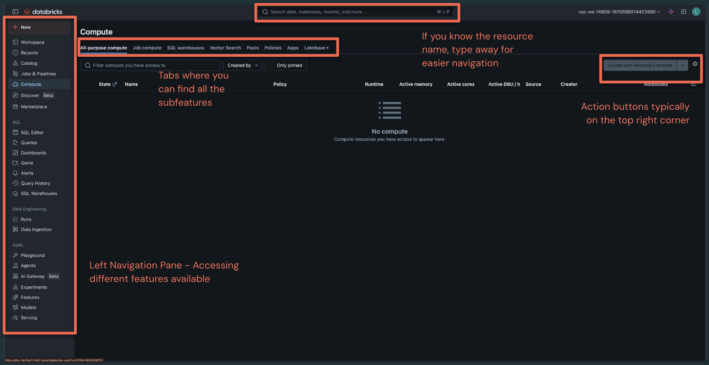

Familiarise with the Databricks workspace layout above.

## Part 1: Build Your First Knowledge Assistant

### 1.0 Explore tables in a Catalog

Let's start with some low hanging fruit - creating a knowledge agent that’s able to answer questions related to your company’s products and policies. For our purposes, we’re going to use a knowledge base that our fictional telco company has curated that covered typical product questions. We’ll also use some historical support tickets to augment our knowledge agent with a constantly updating source of information.

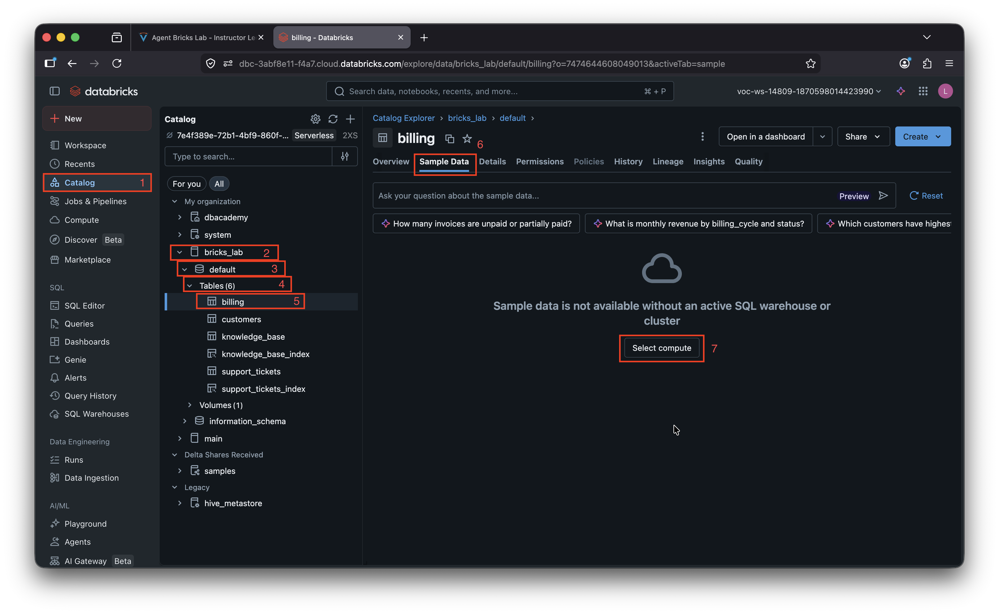

TODO: explain Catalog

Steps:
1. Click on `Catalog` on the left panel.
2. Expand `bricks_lab`.
3. Expand `default`.
4. Expand `Tables`.
5. Click on `billing`.
6. Click on `Sample Data` tab.
7. Click on `Start compute` button.

In the popup, there should be already a resource selected for you. Otherwise click on the drop down and select the only resource there. Click on `Start and Close`.

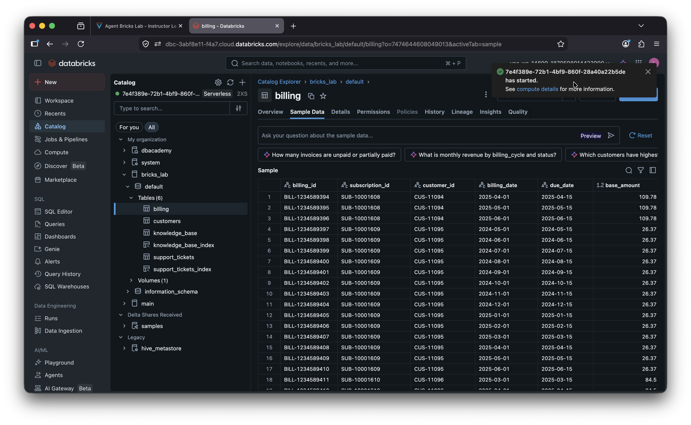

Wait a few minutes until you see that the resourece has started. Once ready, the sample data should load. Examine the sample data here. This is one of the tables we will be using to create our Knowledge Assistant.

### 1.1 Explore a Vector Search Index

Now the first step to making this data work for us is to create a vector search index. Why? We need an efficient way for your agent to retrieve relevant chunks of data to better answer your user’s question. Fortunately, this is super easy. We’ve already created the indexes for you so you do NOT need to create the index (it takes a while to spin up), but your instructor will show you how easy it is to create one.

Why Vector Search?

    Provides efficient retrieval of relevant chunks of data for grounding LLM responses.
    Two common types:
        Triggered updates (for static knowledge bases like FAQs/policies).
        Continuous updates (for dynamic sources like support tickets).

TODO: explain Vector search index
TODO: add <This is also a chance to talk about the types of VS indexes, and say that you can do triggered for knowledge base that updates infrequently and continuous for something like support tickets that are evolving daily.

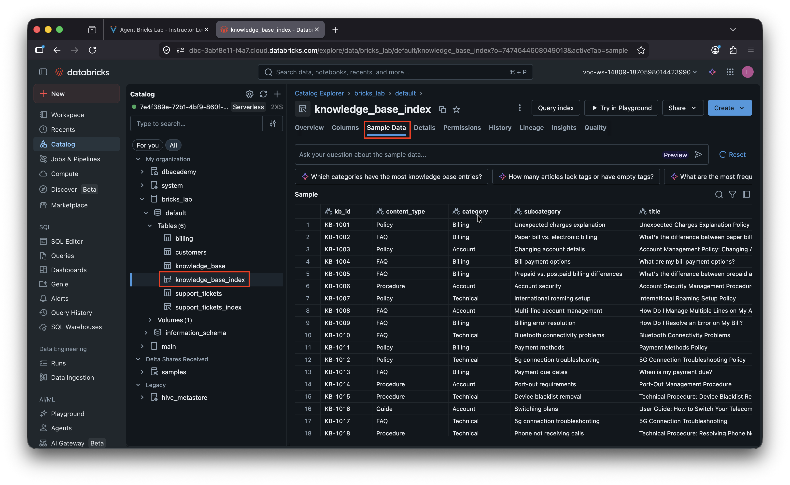

Click on `knowledge_base_index`, then `Sample Data` to see sample data from the knowledge base index. We will create a knowledge assistant which queries this index later. You can also click on `support_tickets_index` to view the support tickets index.

### 1.2 Build the Knowledge Assistant Agent

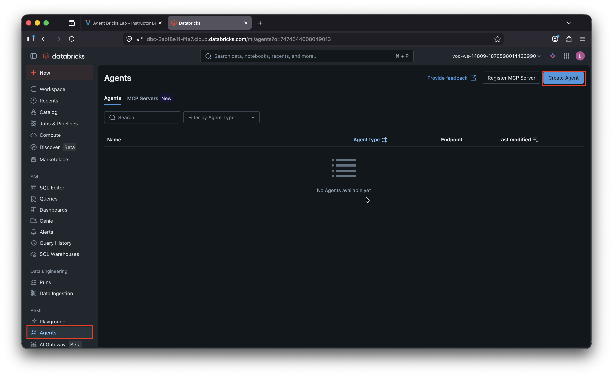

Click on `Agents` on the left side panel, then click on `Create Agent`.

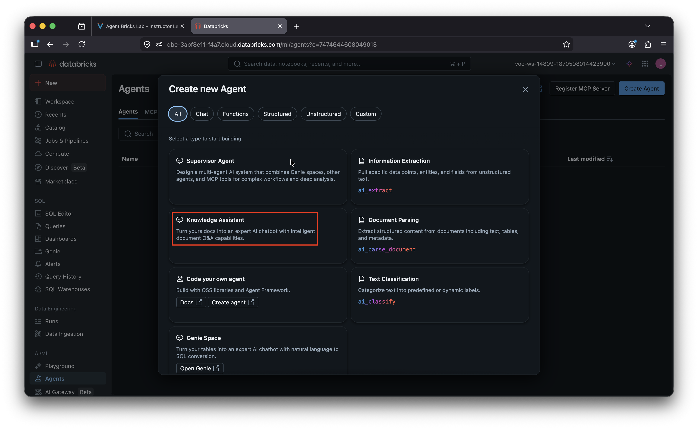

Click on `Knowledge Assistant`.

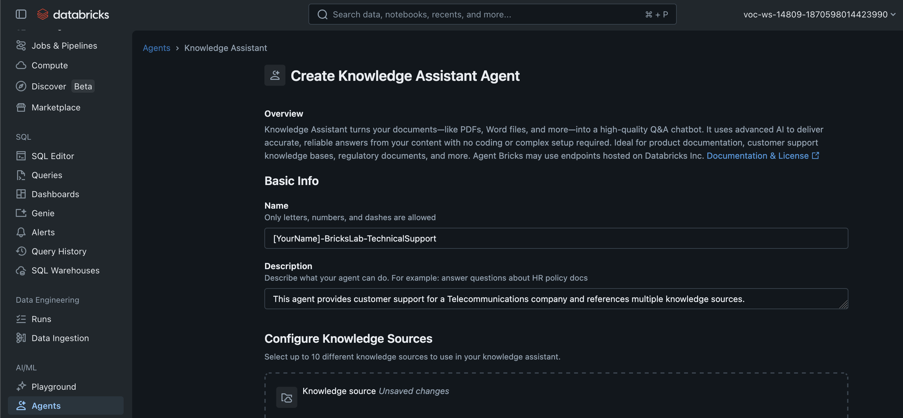

Fill in the name as `[YourName]-BricksLab-TechnicalSupport` (e.g. `Jarrett-BricksLab-TechnicalSupport`) and description as `This agent provides customer support for a Telecommunications company and references multiple knowledge sources.`. The better you describe resources in Databricks, the better Databricks will be able to give you the right answers (e.g. Genie, agents)

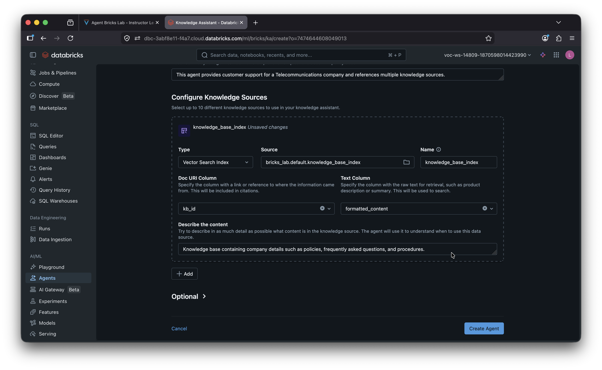

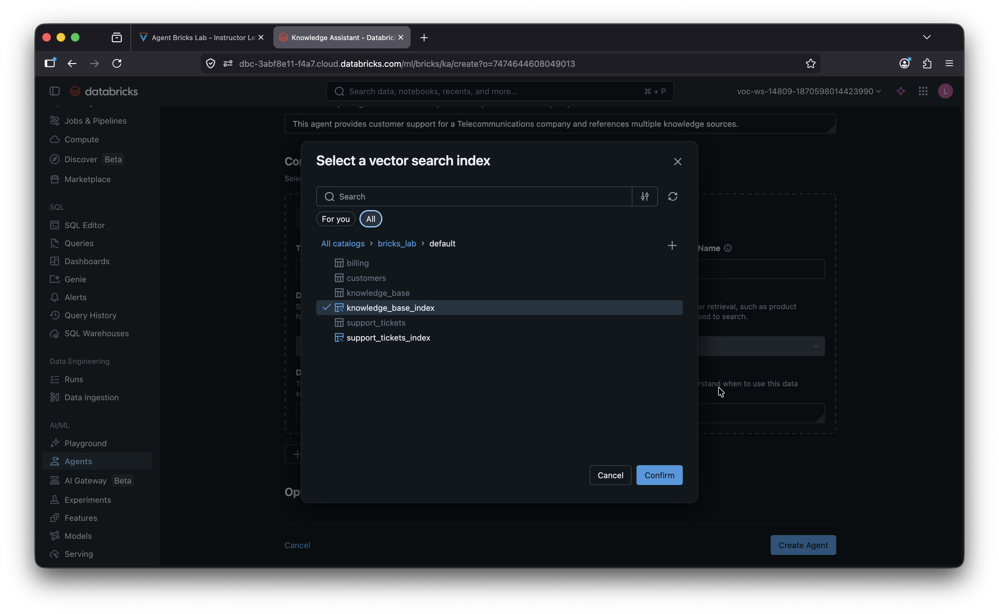

First, add the first index for knowledge base. Under `Configure Knowledge Sources`:
1. For `Type`, select `Vector Search Index`.
2. For `Source`, click on the `All` tab, then navigate to `bricks_lab`, `default`, `knowledge_base_index`, and click `Confirm`.
3. For `Name`, it will be auto-populated as `knowledge_base_index`, leave it.
4. For `Doc URI Column`, select `kb_id`.
5. For `Text Column`, select `formatted_content`.
6. For `Describe the content`, key in `Knowledge base containing company details such as policies, frequently asked questions, and procedures.`.

Next, add the second index for support tickets. Again, under `Configure Knowledge Sources`, click `Add` to add a second index, then:

1. For `Type`, select `Vector Search Index`.
2. For `Source`, click on the `All` tab, then navigate to `bricks_lab`, `default`, `support_tickets_index`, and click `Confirm`.
3. For `Name`, it will be auto-populated as `support_tickets_index`, leave it.
4. For `Doc URI Column`, select `ticket_id`.
5. For `Text Column`, select `formatted_content`.
6. For `Describe the content`, key in `Knowledge base containing historical tickets and resolutions of past customer issues.`.

Finally, click on `Create Agent`. Wait for a few minutes for the agent to create.

Once the agent is created, we’ll want to give it a test! Let's ask it a question in the text box: `How do I know if my 5G is working?` and click the send button (or press Enter).

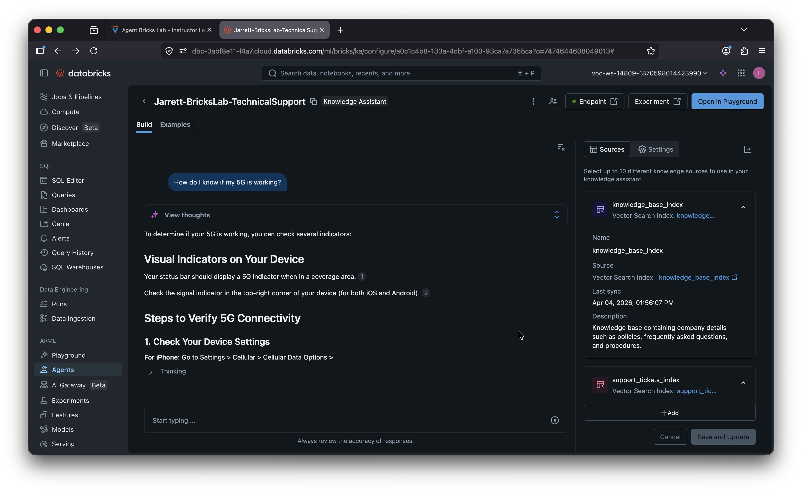

You’ll see a pretty verbose response with a number of footnotes. We’re going to make it more concise later, but what you can see here is that the Knowledge Assistant bases its responses heavily on our sources!

